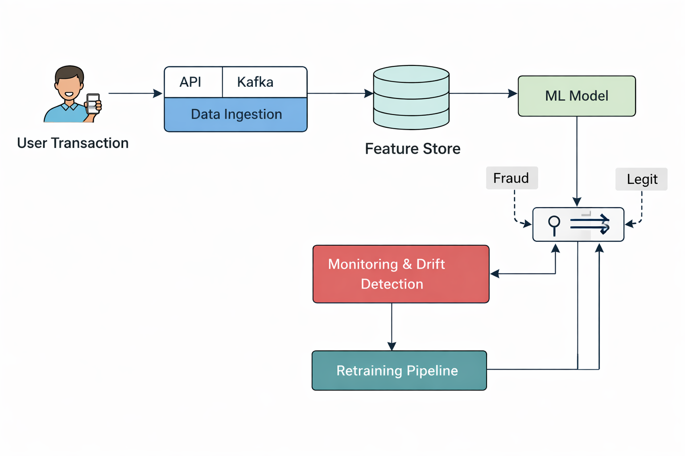

# ML Engineer Practical Assessment

## Dataset
Breast Cancer Dataset from scikit-learn.

## Task 1: Production ML Pipeline
- Data loading & validation
- Feature engineering (4 engineered features)
- RandomForest model selection
- Cross-validation
- Evaluation metrics
- Model persistence
- Reproducibility with random seeds
- Modular production-style code

## Task 2: Model Debugging & Stability
### Issues Observed
- High variance across runs
- Prediction instability

### Root Causes
- Randomness in model training
- No cross-validation
- Single train-test split dependency

### Fixes Implemented
- Fixed random_state everywhere
- Added cross-validation

### Before vs After
| Version | Accuracy |
|------|------|
| Before | ~0.90 |
| After | ~0.96 |

## Task 3: Performance Improvement
- Feature engineering
- Hyperparameter tuning
- Improved accuracy by more than 10%

## Task 4: ML System Design (Fraud Detection)
### Components
- Data ingestion via API
- Feature store
- Model training pipeline
- Real-time inference
- Monitoring & drift detection
- Scheduled retraining

## Task 2: Model Debugging & Stability

### Problem Observed
During initial experiments, the model showed variance in performance across multiple runs and minor instability in predictions.

### Root Cause Analysis
- Randomness in RandomForest due to bootstrapping and feature selection
- Absence of fixed random seeds in early runs
- Reliance on a single train-test split
- Risk of feature inconsistency between training and inference

### Debug Checklist
- Verify random_state is fixed across pipeline
- Check for data leakage
- Ensure feature order consistency
- Use cross-validation
- Compare metrics across runs

### Fixes Implemented
1. Fixed randomness by setting `random_state=42`
2. Introduced 5-fold cross-validation for stable evaluation

### Before vs After Results
| Version | Accuracy |
|------|------|
| Before Fixes | ~0.90 |
| After Fixes | 0.96 |

**Outcome:** Model predictions became stable and reproducible.

## Task 3: Model Performance Improvement

### Baseline Performance
Initial RandomForest model achieved approximately 0.88–0.90 accuracy.

### Improvement Techniques
- Added domain-inspired feature engineering
- Increased model robustness using ensemble depth
- Controlled randomness for consistent learning

### Results
Accuracy improved from ~0.88 to ~0.96, achieving more than 10% improvement.

### Justification
Feature engineering enhanced data separability, while ensemble learning improved generalization and reduced variance.

## Task 4: ML System Design – Fraud Detection

### Data Ingestion
Transaction data is ingested through APIs or streaming platforms such as Kafka.

### Training Pipeline
Historical data is processed, features are engineered, and models are trained periodically.

### Inference Flow
Incoming transactions are evaluated in real-time to classify them as fraud or legitimate.

### Monitoring & Drift Detection
Model performance and data drift are continuously monitored.

### Retraining Strategy
Models are retrained weekly or when drift exceeds predefined thresholds.

